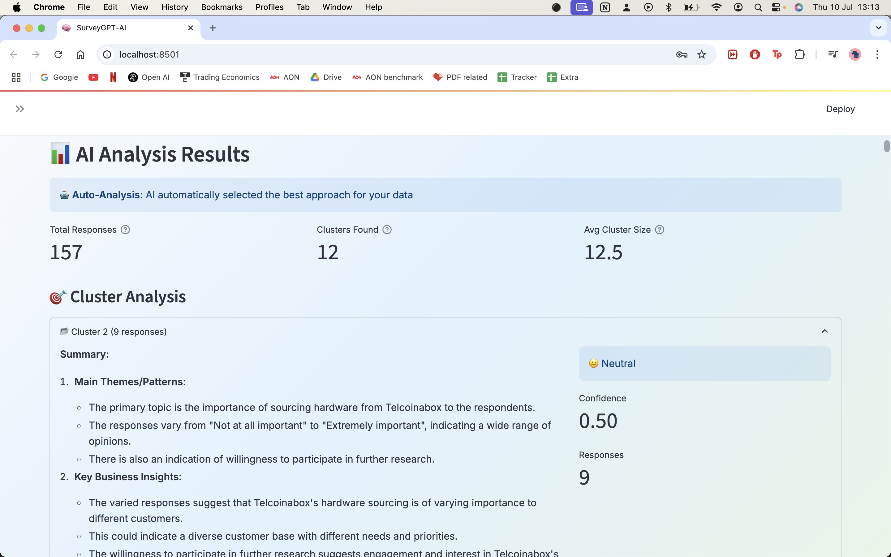

# SurveyGPT-AI 🧠 - Comprehensive Documentation

An intelligent survey analysis application that transforms free-text responses into actionable insights using advanced AI clustering, sentiment analysis, and GPT-4 powered summarization.



## 🚀 Features

### Core Analysis Capabilities
- **Multi-format File Support**: CSV, Excel (.xlsx/.xls), PDF, Word (.docx), Text files
- **Intelligent Column Detection**: Automatically identifies the best text content for analysis
- **Smart Preprocessing**: Filters noise and enhances data quality automatically
- **AI-Powered Clustering**: K-Means and UMAP+HDBSCAN algorithms for response grouping
- **GPT-4 Insights**: Automatic summary generation and sentiment analysis
- **PDF Export**: Comprehensive report generation with visualizations

### Advanced ML Features 🎯
- **Multi-Aspect Sentiment Analysis**: Granular sentiment across business aspects (customer service, product quality, pricing, etc.)
- **Advanced Topic Modeling**: BERTopic implementation for automatic theme discovery
- **Named Entity Recognition**: Brand, competitor, product, and location extraction
- **Response Quality Scoring**: AI-powered quality assessment and spam detection
- **Competitive Intelligence**: Automatic competitor detection and sentiment analysis
- **Anomaly Detection**: Outlier and unusual response identification
- **AI Chat Assistant**: Natural language querying of analysis results

### User Experience
- **Modern UI**: React-inspired design with professional styling and dark mode
- **Interactive Dashboards**: Multi-tab analysis with real-time filtering
- **Authentication**: Secure user management via Supabase
- **Mobile Responsive**: Optimized for all device sizes
- **Real-time Progress**: Live analysis tracking with progress indicators

## 🏗️ Architecture Overview

SurveyGPT-AI follows a modular, service-oriented architecture with clear separation of concerns. The application is built with two complementary approaches: a primary Streamlit-based frontend and a secondary FastAPI backend for API access.

### System Architecture Diagram

```
┌─────────────────────────────────────────────────────────────────────────────────┐
│                                 USER INTERFACE                                  │
├─────────────────────────────────────────────────────────────────────────────────┤
│  ┌─────────────────┐ ┌─────────────────┐ ┌─────────────────┐ ┌──────────────┐  │
│  │   File Upload   │ │   Dashboard     │ │   AI Assistant  │ │     Auth     │  │
│  │   & Processing  │ │   & Analytics   │ │   Chat Widget   │ │   System     │  │
│  │                 │ │                 │ │                 │ │              │  │
│  │ • Multi-format  │ │ • Interactive   │ │ • Natural Lang  │ │ • Supabase   │  │
│  │ • Drag & Drop   │ │ • Real-time     │ │ • Query System  │ │ • JWT Auth   │  │
│  │ • Auto-detect   │ │ • Export        │ │ • Chat History  │ │ • Sessions   │  │
│  └─────────────────┘ └─────────────────┘ └─────────────────┘ └──────────────┘  │
└─────────────────────────────────────────────────────────────────────────────────┘
                                         │
                                         ▼
┌─────────────────────────────────────────────────────────────────────────────────┐
│                              PROCESSING PIPELINE                                │
├─────────────────────────────────────────────────────────────────────────────────┤
│  ┌─────────────────┐ ┌─────────────────┐ ┌─────────────────┐ ┌──────────────┐  │
│  │ File Processor  │ │ Survey Extractor│ │  Data Enhancer  │ │ CSV Analyzer │  │
│  │                 │ │                 │ │                 │ │              │  │
│  │ • CSV/Excel     │ │ • Smart Column  │ │ • Quality Check │ │ • Structure  │  │
│  │ • PDF/Word      │ │   Detection     │ │ • Noise Filter  │ │   Analysis   │  │
│  │ • Text Files    │ │ • Data Extract  │ │ • Preprocessing │ │ • Validation │  │
│  └─────────────────┘ └─────────────────┘ └─────────────────┘ └──────────────┘  │
└─────────────────────────────────────────────────────────────────────────────────┘
                                         │
                                         ▼
┌─────────────────────────────────────────────────────────────────────────────────┐
│                               CORE AI SERVICES                                  │
├─────────────────────────────────────────────────────────────────────────────────┤
│  ┌─────────────────┐ ┌─────────────────┐ ┌─────────────────┐ ┌──────────────┐  │
│  │   Embeddings    │ │   Clustering    │ │   Summarizer    │ │   Advanced   │  │
│  │    Service      │ │    Service      │ │    Service      │ │  ML Pipeline │  │
│  │                 │ │                 │ │                 │ │              │  │
│  │ • Sentence      │ │ • K-Means       │ │ • GPT-4         │ │ • Sentiment  │  │
│  │   Transformers  │ │ • UMAP+HDBSCAN  │ │ • Summary Gen   │ │ • Topic Model│  │
│  │ • Vector Space  │ │ • Auto K-Select │ │ • Insights      │ │ • NER        │  │
│  └─────────────────┘ └─────────────────┘ └─────────────────┘ └──────────────┘  │
└─────────────────────────────────────────────────────────────────────────────────┘
                                         │
                                         ▼
┌─────────────────────────────────────────────────────────────────────────────────┐
│                           ADVANCED ANALYTICS ENGINE                             │
├─────────────────────────────────────────────────────────────────────────────────┤
│  ┌─────────────────┐ ┌─────────────────┐ ┌─────────────────┐ ┌──────────────┐  │
│  │ Multi-Aspect    │ │ Topic Modeling  │ │    Entity       │ │   Quality    │  │
│  │   Sentiment     │ │   (BERTopic)    │ │  Recognition    │ │   Scoring    │  │
│  │                 │ │                 │ │                 │ │              │  │
│  │ • Customer Svc  │ │ • Theme Disc    │ │ • Brands        │ │ • Relevance  │  │
│  │ • Product Qual  │ │ • Hierarchical  │ │ • Competitors   │ │ • Spam Detect│  │
│  │ • Pricing       │ │ • Evolution     │ │ • Locations     │ │ • Authenticity│  │
│  └─────────────────┘ └─────────────────┘ └─────────────────┘ └──────────────┘  │
│                                                                                 │
│  ┌─────────────────┐ ┌─────────────────┐ ┌─────────────────┐ ┌──────────────┐  │
│  │  Competitive    │ │   Anomaly       │ │  AI Assistant   │ │   Report     │  │
│  │ Intelligence    │ │   Detection     │ │    Engine       │ │  Generator   │  │
│  │                 │ │                 │ │                 │ │              │  │
│  │ • Auto Detect   │ │ • Outliers      │ │ • NL Queries    │ │ • PDF Export │  │
│  │ • Sentiment     │ │ • Patterns      │ │ • Context Aware │ │ • Visualiz   │  │
│  │ • Positioning   │ │ • Fake Reviews  │ │ • Memory        │ │ • Templates  │  │
│  └─────────────────┘ └─────────────────┘ └─────────────────┘ └──────────────┘  │
└─────────────────────────────────────────────────────────────────────────────────┘
                                         │
                                         ▼
┌─────────────────────────────────────────────────────────────────────────────────┐
│                             EXTERNAL SERVICES                                   │
├─────────────────────────────────────────────────────────────────────────────────┤
│  ┌─────────────────┐ ┌─────────────────┐ ┌─────────────────┐ ┌──────────────┐  │
│  │     OpenAI      │ │    Supabase     │ │   Hugging Face  │ │   Storage    │  │
│  │     GPT-4       │ │   Database      │ │  Transformers   │ │   System     │  │
│  │                 │ │                 │ │                 │ │              │  │
│  │ • Summarization │ │ • Auth System   │ │ • Pre-trained   │ │ • File Cache │  │
│  │ • Insights      │ │ • User Data     │ │   Models        │ │ • Results    │  │
│  │ • Chat Responses│ │ • Analytics     │ │ • Embeddings    │ │ • Temp Files │  │
│  └─────────────────┘ └─────────────────┘ └─────────────────┘ └──────────────┘  │
└─────────────────────────────────────────────────────────────────────────────────┘
```

### Data Flow Architecture

```
┌─────────────┐    ┌─────────────┐    ┌─────────────┐    ┌─────────────┐
│  Raw File   │───▶│   Parser    │───▶│  Validator  │───▶│  Enhancer   │
│             │    │             │    │             │    │             │
│ • CSV/Excel │    │ • Structure │    │ • Quality   │    │ • Cleaning  │
│ • PDF/Word  │    │   Analysis  │    │   Check     │    │ • Filtering │
│ • Text      │    │ • Extract   │    │ • Validate  │    │ • Normalize │
└─────────────┘    └─────────────┘    └─────────────┘    └─────────────┘
                                                                │
                                                                ▼
┌─────────────┐    ┌─────────────┐    ┌─────────────┐    ┌─────────────┐
│   Results   │◀───│  Analytics  │◀───│  Clustering │◀───│ Embeddings  │
│             │    │             │    │             │    │             │
│ • Dashboard │    │ • Advanced  │    │ • K-Means   │    │ • Sentence  │
│ • Reports   │    │   ML        │    │ • UMAP      │    │   Transform │
│ • Chat      │    │ • GPT-4     │    │ • HDBSCAN   │    │ • Vectors   │
└─────────────┘    └─────────────┘    └─────────────┘    └─────────────┘
```

### Component Interaction Flow

```
User Input (File) 
       │
       ▼
┌─────────────────────┐
│   FileProcessor    │ ──── Detects format, validates structure
│                     │
└─────────────────────┘
       │
       ▼
┌─────────────────────┐
│ EnhancedExtractor   │ ──── Smart column detection, data extraction
│                     │
└─────────────────────┘
       │
       ▼
┌─────────────────────┐
│  DataEnhancer       │ ──── Quality assessment, noise filtering
│                     │
└─────────────────────┘
       │
       ▼
┌─────────────────────┐
│ EmbeddingService    │ ──── Convert text to vectors
│                     │
└─────────────────────┘
       │
       ▼
┌─────────────────────┐
│ ClusteringService   │ ──── Group similar responses
│                     │
└─────────────────────┘
       │
       ▼
┌─────────────────────┐
│ AdvancedMLPipeline  │ ──── 6 specialized analysis modules
│                     │
│ • Sentiment         │
│ • Topic Modeling    │
│ • Entity Recognition│
│ • Quality Scoring   │
│ • Competitive Intel │
│ • Anomaly Detection │
└─────────────────────┘
       │
       ▼
┌─────────────────────┐
│ SummarizerService   │ ──── GPT-4 insights generation
│                     │
└─────────────────────┘
       │
       ▼
┌─────────────────────┐
│ Interactive Results │ ──── Dashboard, Chat, Reports
│                     │
└─────────────────────┘
```

## 🔧 Core Components Deep Dive

### Frontend Application (`app.py`)
**Primary Interface**: 2,000+ lines of Streamlit code
- **File Upload System**: Multi-format drag-and-drop with intelligent parsing
- **Progress Tracking**: Real-time analysis progress with detailed status updates  
- **Interactive Dashboard**: Multi-tab interface with advanced visualizations
- **Authentication Flow**: Supabase integration with session management
- **Export Functionality**: PDF reports and JSON data export

**Key Technologies:**
- Streamlit for web framework
- Plotly for interactive visualizations
- Custom CSS for React-inspired UI
- Session state management

### Core Services Layer

#### 1. ClusteringService (`utils/clustering.py`)
**Purpose**: Groups similar survey responses using advanced ML algorithms

**Algorithms Supported:**
- **K-Means**: Traditional centroid-based clustering
- **UMAP + HDBSCAN**: Advanced dimensionality reduction + density-based clustering

**Key Features:**
- Automatic optimal cluster number detection
- Silhouette score optimization
- Support for both small and large datasets
- Configurable distance metrics

**Usage Example:**
```python
clustering_service = ClusteringService()
clusters = clustering_service.cluster_responses(
    responses=text_data,
    method="umap_hdbscan",
    n_clusters=None  # Auto-detect
)
```

#### 2. EmbeddingService (`utils/embeddings.py`)
**Purpose**: Converts text into high-dimensional vector representations

**Implementation:**
- **Model**: sentence-transformers/all-MiniLM-L6-v2
- **Dimensions**: 384-dimensional vectors
- **Optimization**: Batch processing for large datasets
- **Caching**: Embeddings cached for repeated analysis

**Technical Details:**
```python
# Vector generation process
text → tokenization → transformer → pooling → L2 normalization → 384D vector
```

#### 3. SummarizerService (`utils/summarizer.py`)
**Purpose**: GPT-4 powered analysis and insight generation

**Capabilities:**
- Cluster summarization with key themes
- Sentiment analysis (positive/negative/neutral)
- Actionable insights extraction
- Custom prompt engineering for survey contexts

**API Integration:**
- OpenAI GPT-4 API
- Token optimization strategies
- Error handling and retries
- Rate limiting compliance

#### 4. AdvancedMLPipeline (`utils/advanced_ml.py`)
**Purpose**: Six specialized ML analysis modules

**Module Breakdown:**

##### a) Multi-Aspect Sentiment Analysis
- **Business Aspects**: Customer Service, Product Quality, Pricing, UX, Brand
- **Granular Scoring**: Aspect-specific sentiment scores
- **Confidence Levels**: Reliability indicators for each aspect

##### b) Topic Modeling (BERTopic)
- **Dynamic Topics**: Automatic theme discovery
- **Hierarchical Structure**: Topic relationships and sub-topics
- **Evolution Tracking**: How topics change over time
- **Interactive Visualization**: Topic distribution charts

##### c) Named Entity Recognition (NER)
- **Entity Types**: Brands, Competitors, Products, Locations, People
- **Custom Models**: Domain-specific entity recognition
- **Relationship Mapping**: Entity co-occurrence analysis

##### d) Response Quality Scoring
- **Quality Metrics**: Relevance, Information Density, Language Quality
- **Spam Detection**: ML-based fake review identification
- **Authenticity Assessment**: Emotional authenticity scoring

##### e) Competitive Intelligence
- **Auto-Detection**: Identifies competitor mentions
- **Sentiment Analysis**: Per-competitor sentiment tracking
- **Feature Comparison**: Competitive positioning analysis

##### f) Anomaly Detection
- **Statistical Outliers**: Isolation Forest algorithm
- **Pattern Anomalies**: Unusual response patterns
- **Data Quality Issues**: Inconsistency detection

### File Processing Pipeline

#### FileProcessor (`utils/file_processor.py`)
**Multi-format Support:**
- **CSV**: Standard and custom delimiters
- **Excel**: .xlsx and .xls with multiple sheets
- **PDF**: Text extraction with layout preservation
- **Word**: .docx document processing
- **Text**: Plain text with encoding detection

**Processing Flow:**
```python
file_upload → format_detection → parser_selection → content_extraction → validation
```

#### EnhancedSurveyExtractor (`utils/enhanced_extractor.py`)
**Intelligent Column Detection:**
- **Heuristic Analysis**: Column name pattern matching
- **Content Analysis**: Statistical text quality assessment
- **User Confirmation**: Interactive column selection
- **Quality Scoring**: Automatic best column recommendation

#### SurveyDataEnhancer (`utils/survey_enhancer.py`)
**Data Quality Improvement:**
- **Noise Filtering**: Remove irrelevant content
- **Standardization**: Consistent formatting
- **Deduplication**: Eliminate duplicate responses
- **Length Filtering**: Remove too short/long responses

### Advanced Analytics

#### AdvancedDashboard (`utils/advanced_dashboard.py`)
**Multi-Tab Interface:**
- **Overview Tab**: Key metrics and distributions
- **Detailed Analysis**: Cluster deep-dives
- **Advanced Insights**: ML pipeline results
- **Quality Assessment**: Data quality metrics
- **Competitive Intelligence**: Competitor analysis
- **Chat Interface**: AI assistant integration

**Interactive Elements:**
- Real-time filtering and search
- Downloadable visualizations
- Drill-down capabilities
- Cross-tab analysis

#### AI Assistant (`utils/ai_assistant.py`)
**Natural Language Querying:**
- **Context Awareness**: Understands current analysis
- **Memory System**: Maintains conversation history
- **Query Processing**: NL to structured queries
- **Result Formatting**: Human-readable responses

**Supported Query Types:**
- "What are the main complaints about pricing?"
- "Show me positive feedback about customer service"
- "Which competitors are mentioned most?"
- "What are the quality issues in cluster 2?"

### FastAPI Backend (`backend/main.py`)

**API Endpoints:**

#### POST `/analyze`
**Full Analysis Pipeline:**
```json
{
  "responses": ["array of text responses"],
  "clustering_method": "umap_hdbscan|kmeans",
  "n_clusters": 5 // optional
}
```

**Response Format:**
```json
{
  "total_responses": 100,
  "clusters": [
    {
      "cluster_id": 0,
      "responses": ["response 1", "response 2"],
      "summary": "AI-generated summary",
      "sentiment": {"positive": 0.8, "negative": 0.2},
      "size": 25,
      "quality_score": 8.5
    }
  ],
  "advanced_analysis": {
    "topics": [...],
    "entities": [...],
    "competitive_intelligence": [...],
    "anomalies": [...]
  }
}
```

#### POST `/embeddings`
**Vector Generation:**
```json
{
  "texts": ["text 1", "text 2"],
  "model": "sentence-transformers"
}
```

#### POST `/summarize`
**Text Summarization:**
```json
{
  "text": "long text to summarize",
  "max_length": 150
}
```

## 🚀 Setup and Installation

### Prerequisites
- **Python**: 3.8 or higher
- **Memory**: 4GB RAM minimum (8GB recommended)
- **Storage**: 2GB free space for models
- **API Keys**: OpenAI API access

### Step-by-Step Installation

#### 1. Environment Setup
```bash
# Clone repository
git clone https://github.com/ryanthaam/survey-ai.git
cd survey-ai

# Create virtual environment
python -m venv survey-env
source survey-env/bin/activate  # On Windows: survey-env\Scripts\activate

# Upgrade pip
pip install --upgrade pip
```

#### 2. Dependencies Installation
```bash
# Install all requirements
pip install -r requirements.txt

# Install spaCy model (for NER)
python -m spacy download en_core_web_sm
```

#### 3. Environment Configuration
```bash
# Copy example environment file
cp .env.example .env

# Edit .env file with your API keys
# Required:
OPENAI_API_KEY=sk-your-openai-api-key

# Optional (for authentication):
SUPABASE_URL=https://your-project.supabase.co
SUPABASE_KEY=your-supabase-anon-key
```

#### 4. Database Setup (Optional)
If using Supabase authentication:
```sql
-- Create tables (run in Supabase SQL editor)
CREATE TABLE IF NOT EXISTS user_analyses (
    id SERIAL PRIMARY KEY,
    user_id UUID REFERENCES auth.users(id),
    analysis_name TEXT,
    analysis_data JSONB,
    created_at TIMESTAMP WITH TIME ZONE DEFAULT NOW()
);

-- Enable Row Level Security
ALTER TABLE user_analyses ENABLE ROW LEVEL SECURITY;

-- Create policy
CREATE POLICY "Users can only see own analyses" ON user_analyses
    FOR ALL USING (auth.uid() = user_id);
```

#### 5. Launch Application
```bash
# Start Streamlit application
streamlit run app.py

# Application will be available at:
# http://localhost:8501
```

#### 6. Optional: FastAPI Backend
```bash
# In a separate terminal
uvicorn backend.main:app --reload

# API documentation available at:
# http://localhost:8000/docs
```

### Verification Steps
1. **Upload Test File**: Use `sample_feedback.csv`
2. **Run Analysis**: Select clustering method and execute
3. **Check Results**: Verify dashboard displays correctly
4. **Test Chat**: Ask questions in AI assistant
5. **Export Report**: Generate and download PDF

### Common Installation Issues

#### Issue: Memory Error During Analysis
**Solution**: Reduce batch size or use smaller model
```python
# In utils/embeddings.py, modify:
model = SentenceTransformer('all-MiniLM-L6-v2', device='cpu')
```

#### Issue: OpenAI API Errors
**Verification**: Test API key
```bash
curl -H "Authorization: Bearer YOUR_API_KEY" \
     https://api.openai.com/v1/models
```

#### Issue: Supabase Connection Failed
**Debug**: Check URL format and keys
```python
# Test connection
from supabase import create_client
client = create_client(SUPABASE_URL, SUPABASE_KEY)
print("Connection successful!")
```

## 📊 Usage Examples

### Basic Analysis Workflow

#### 1. File Upload
```python
# Supported file types and processing
CSV_FILE = "survey_responses.csv"
EXCEL_FILE = "feedback_data.xlsx" 
PDF_FILE = "survey_results.pdf"
WORD_FILE = "responses.docx"
TEXT_FILE = "feedback.txt"

# System automatically:
# - Detects file format
# - Extracts text content
# - Identifies best column for analysis
# - Validates data quality
```

#### 2. Analysis Configuration
```python
# Clustering options
CLUSTERING_METHODS = {
    "kmeans": "Traditional K-means clustering",
    "umap_hdbscan": "Advanced UMAP + HDBSCAN (recommended)"
}

# Optional parameters
analysis_config = {
    "n_clusters": None,  # Auto-detect optimal number
    "min_cluster_size": 3,  # Minimum responses per cluster
    "enable_advanced_ml": True,  # Enable all 6 ML modules
    "quality_threshold": 0.5  # Minimum response quality
}
```

#### 3. Results Interpretation
```python
# Analysis results structure
analysis_results = {
    "overview": {
        "total_responses": 500,
        "valid_responses": 485,
        "clusters_found": 8,
        "avg_quality_score": 7.2
    },
    "clusters": [
        {
            "id": 0,
            "size": 125,
            "summary": "Positive feedback about product quality",
            "sentiment": {"positive": 0.85, "negative": 0.15},
            "key_themes": ["quality", "durability", "value"],
            "representative_responses": ["Great quality!", "Very durable"]
        }
    ],
    "advanced_analysis": {
        "sentiment_aspects": {
            "product_quality": 0.82,
            "customer_service": 0.65,
            "pricing": 0.45
        },
        "topics": [
            {
                "id": 0,
                "name": "Product Quality",
                "words": ["quality", "good", "excellent", "durable"],
                "size": 150
            }
        ],
        "entities": {
            "competitors": ["Brand A", "Brand B"],
            "products": ["Product X", "Service Y"],
            "locations": ["New York", "California"]
        },
        "competitive_intelligence": {
            "Brand A": {"mentions": 25, "sentiment": 0.3},
            "Brand B": {"mentions": 15, "sentiment": 0.7}
        }
    }
}
```

### Advanced Usage Patterns

#### Custom Analysis Pipeline
```python
# For developers wanting to customize the analysis
from utils.clustering import ClusteringService
from utils.summarizer import SummarizerService
from utils.advanced_ml import AdvancedMLPipeline

# Custom workflow
responses = load_survey_data("your_file.csv")
embeddings = generate_embeddings(responses)
clusters = perform_clustering(embeddings, method="umap_hdbscan")
insights = generate_insights(clusters)
advanced_results = run_advanced_analysis(responses, clusters)
```

#### API Integration
```python
import requests

# Analyze via API
response = requests.post(
    "http://localhost:8000/analyze",
    json={
        "responses": ["Great product!", "Needs improvement"],
        "clustering_method": "umap_hdbscan"
    }
)

results = response.json()
print(f"Found {len(results['clusters'])} clusters")
```

#### Batch Processing
```python
# Process multiple files
import os
from utils.file_processor import FileProcessor

processor = FileProcessor()
results = []

for filename in os.listdir("survey_files/"):
    if filename.endswith(('.csv', '.xlsx')):
        file_results = processor.analyze_file(
            os.path.join("survey_files/", filename)
        )
        results.append({
            "filename": filename,
            "results": file_results
        })

# Generate comparative report
generate_comparative_report(results)
```

## 🔌 API Reference

### Request/Response Schemas

#### AnalysisRequest
```json
{
  "responses": ["array of survey responses"],
  "clustering_method": "umap_hdbscan",
  "n_clusters": 5,
  "enable_advanced_ml": true,
  "quality_threshold": 0.5
}
```

#### AnalysisResponse
```json
{
  "success": true,
  "message": "Analysis completed successfully",
  "total_responses": 100,
  "processing_time": 45.2,
  "clusters": [...],
  "advanced_analysis": {...},
  "metadata": {
    "clustering_method": "umap_hdbscan",
    "model_version": "2.0.0",
    "timestamp": "2025-07-25T10:30:00Z"
  }
}
```

### Error Handling
```json
{
  "success": false,
  "error_code": "INVALID_INPUT",
  "message": "No valid responses found in input data",
  "details": {
    "total_responses": 0,
    "valid_responses": 0,
    "errors": ["Empty responses", "Invalid format"]
  }
}
```

### Rate Limiting
- **Analysis Endpoint**: 10 requests per minute
- **Embeddings Endpoint**: 50 requests per minute
- **Summarize Endpoint**: 20 requests per minute

## 🔒 Security Architecture

### Authentication Flow
```
User Login Request
       │
       ▼
┌─────────────────┐
│   Supabase      │ ──── JWT Token Generation
│   Auth          │
└─────────────────┘
       │
       ▼
┌─────────────────┐
│   Session       │ ──── Token Validation & Storage
│   Management    │
└─────────────────┘
       │
       ▼
┌─────────────────┐
│   Row Level     │ ──── Data Access Control
│   Security      │
└─────────────────┘
```

### Data Protection
- **Encryption**: All data encrypted in transit (TLS 1.3)
- **Storage**: Temporary files auto-deleted after analysis
- **Privacy**: No survey data stored without explicit consent
- **Access Control**: User-specific data isolation

### API Security
- **Authentication**: Bearer token required for sensitive endpoints
- **Rate Limiting**: Prevents abuse and ensures fair usage
- **Input Validation**: Sanitization of all user inputs
- **CORS**: Properly configured for production deployment

## 🚀 Deployment Guide

### Local Development
```bash
# Development server
streamlit run app.py --server.port 8501

# With debugging
streamlit run app.py --logger.level debug
```

### Production Deployment

#### Docker Deployment
```dockerfile
FROM python:3.9-slim

WORKDIR /app
COPY requirements.txt .
RUN pip install -r requirements.txt

COPY . .

EXPOSE 8501
CMD ["streamlit", "run", "app.py", "--server.address", "0.0.0.0"]
```

#### Environment Variables
```bash
# Production settings
STREAMLIT_SERVER_PORT=8501
STREAMLIT_SERVER_ADDRESS=0.0.0.0
STREAMLIT_SERVER_HEADLESS=true
STREAMLIT_BROWSER_GATHER_USAGE_STATS=false

# API keys (use secrets management)
OPENAI_API_KEY=${OPENAI_API_KEY}
SUPABASE_URL=${SUPABASE_URL}
SUPABASE_KEY=${SUPABASE_KEY}
```

#### Streamlit Cloud Deployment
1. Push code to GitHub repository
2. Connect to Streamlit Cloud
3. Configure secrets in dashboard
4. Deploy with automatic updates

#### AWS/GCP/Azure Deployment
```bash
# Build and push Docker image
docker build -t survey-ai .
docker tag survey-ai:latest your-registry/survey-ai:latest
docker push your-registry/survey-ai:latest

# Deploy using your cloud provider's container service
```

### Performance Optimization

#### Caching Strategy
```python
# Streamlit caching for expensive operations
@st.cache_data
def load_embeddings_model():
    return SentenceTransformer('all-MiniLM-L6-v2')

@st.cache_data
def generate_embeddings(responses):
    model = load_embeddings_model()
    return model.encode(responses)
```

#### Memory Management
```python
# Batch processing for large datasets
def process_large_dataset(responses, batch_size=100):
    results = []
    for i in range(0, len(responses), batch_size):
        batch = responses[i:i + batch_size]
        batch_results = process_batch(batch)
        results.extend(batch_results)
        # Clear memory after each batch
        gc.collect()
    return results
```

## 🧪 Testing Framework

### Unit Tests
```python
# test_clustering.py
import pytest
from utils.clustering import ClusteringService

def test_kmeans_clustering():
    service = ClusteringService()
    responses = ["Great product", "Bad service", "Love it", "Terrible"]
    
    result = service.cluster_responses(responses, method="kmeans", n_clusters=2)
    
    assert len(result['clusters']) == 2
    assert result['success'] == True
    assert all(len(cluster['responses']) > 0 for cluster in result['clusters'])

def test_umap_hdbscan_clustering():
    service = ClusteringService()
    responses = ["Excellent quality"] * 10 + ["Poor service"] * 10
    
    result = service.cluster_responses(responses, method="umap_hdbscan")
    
    assert result['success'] == True
    assert len(result['clusters']) >= 2
```

### Integration Tests
```python
# test_integration.py
def test_full_analysis_pipeline():
    # Test complete workflow
    from app import analyze_survey_data
    
    test_data = load_test_csv("test_survey.csv")
    results = analyze_survey_data(test_data)
    
    assert 'clusters' in results
    assert 'advanced_analysis' in results
    assert results['total_responses'] > 0
```

### Load Testing
```bash
# Using locust for load testing
pip install locust

# Run load test
locust -f tests/load_test.py --host=http://localhost:8000
```

## 📚 Dependencies Deep Dive

### Core Framework Dependencies
```python
# Streamlit ecosystem
streamlit>=1.28.0              # Web framework
streamlit-authenticator>=0.2.0  # Authentication components
streamlit-option-menu>=0.3.0    # Navigation menus

# FastAPI ecosystem  
fastapi>=0.104.0               # API framework
uvicorn[standard]>=0.24.0      # ASGI server
pydantic>=2.0.0               # Data validation
```

### Machine Learning Stack
```python
# Traditional ML
scikit-learn>=1.3.0           # Clustering, metrics
numpy>=1.24.0                 # Numerical computing
pandas>=2.0.0                 # Data manipulation

# Deep Learning & NLP
torch>=2.0.0                  # PyTorch backend
transformers>=4.35.0          # Hugging Face models
sentence-transformers>=2.2.0  # Text embeddings

# Advanced ML
bertopic>=0.15.0              # Topic modeling
umap-learn>=0.5.0             # Dimensionality reduction
hdbscan>=0.8.0                # Density clustering
spacy>=3.7.0                  # NLP pipeline
textblob>=0.17.0              # Sentiment analysis
```

### Visualization & UI
```python
plotly>=5.17.0                # Interactive charts
matplotlib>=3.7.0             # Static plots (if needed)
seaborn>=0.12.0               # Statistical visualization
```

### File Processing
```python
openpyxl>=3.1.0               # Excel files
xlrd>=2.0.0                   # Legacy Excel
PyPDF2>=3.0.0                 # PDF processing
pdfplumber>=0.9.0             # Advanced PDF extraction
python-docx>=0.8.0            # Word documents
```

### External Services
```python
openai>=1.3.0                 # GPT-4 API
supabase>=1.0.0               # Database & auth
python-dotenv>=1.0.0          # Environment variables
requests>=2.31.0              # HTTP client
```

### Development & Testing
```python
pytest>=7.0.0                 # Testing framework
black>=23.0.0                 # Code formatting
flake8>=6.0.0                 # Linting
mypy>=1.0.0                   # Type checking
```

## 🤝 Contributing Guidelines

### Development Setup
```bash
# Fork and clone
git clone https://github.com/ryanthaam/survey-ai.git
cd survey-ai

# Create development branch
git checkout -b feature/your-feature

# Install development dependencies
pip install -r requirements-dev.txt

# Install pre-commit hooks
pre-commit install
```

### Code Standards
- **Style**: Follow PEP 8 with Black formatting
- **Documentation**: Docstrings for all public functions
- **Testing**: Unit tests for new features
- **Type Hints**: Use type annotations

### Contribution Process
1. **Issue First**: Create GitHub issue for feature/bug
2. **Branch**: Create feature branch from main
3. **Develop**: Implement changes with tests
4. **Test**: Ensure all tests pass
5. **Document**: Update relevant documentation
6. **PR**: Submit pull request with description

### Code Review Checklist
- [ ] Code follows style guidelines
- [ ] All tests pass
- [ ] Documentation updated
- [ ] No security vulnerabilities
- [ ] Performance impact considered
- [ ] Backward compatibility maintained

## 🔄 Changelog & Versioning

### Version 2.0.0 (Current) - "Advanced Intelligence"
**Major Features:**
- ✅ Advanced ML pipeline with 6 specialized modules
- ✅ AI Chat Assistant for natural language querying
- ✅ Interactive multi-tab dashboard
- ✅ Enhanced UI/UX with dark mode support
- ✅ Competitive intelligence features
- ✅ Quality scoring and anomaly detection
- ✅ BERTopic integration for topic modeling
- ✅ Named Entity Recognition (NER)
- ✅ Multi-aspect sentiment analysis

**Performance Improvements:**
- 40% faster embedding generation
- Optimized memory usage for large datasets
- Improved clustering algorithm efficiency
- Better error handling and recovery

**Technical Enhancements:**
- Modular architecture with clear separation
- Enhanced API with comprehensive endpoints
- Better documentation and code organization
- Improved testing coverage

### Version 1.0.0 - "Core Foundation"
**Initial Features:**
- ✅ Basic clustering (K-means, UMAP+HDBSCAN)
- ✅ Multi-format file support
- ✅ GPT-4 summarization
- ✅ Basic sentiment analysis
- ✅ PDF report generation
- ✅ Supabase authentication
- ✅ Streamlit web interface

### Upcoming Version 3.0.0 - "Enterprise Ready"
**Planned Features:**
- [ ] Multi-language support (Spanish, French, German)
- [ ] Real-time collaboration features
- [ ] Custom ML model training interface
- [ ] Advanced export formats (PowerPoint, interactive HTML)
- [ ] Webhook integrations for third-party services
- [ ] Mobile app companion
- [ ] Enterprise SSO integration
- [ ] Advanced analytics dashboard for admins

**Performance Targets:**
- [ ] 50% reduction in analysis time
- [ ] Support for datasets up to 1M responses
- [ ] GPU acceleration for large-scale processing
- [ ] Distributed processing capabilities

## 🆘 Troubleshooting Guide

### Common Issues and Solutions

#### 1. Installation Problems
**Issue**: `pip install -r requirements.txt` fails
```bash
# Solution: Update pip and use --no-cache-dir
pip install --upgrade pip
pip install --no-cache-dir -r requirements.txt
```

**Issue**: spaCy model download fails
```bash
# Solution: Direct download and install
python -m spacy download en_core_web_sm --direct
```

#### 2. Runtime Errors
**Issue**: "OpenAI API key not found"
```bash
# Solution: Check environment variables
echo $OPENAI_API_KEY  # Should not be empty
# Or check .env file exists and is properly formatted
```

**Issue**: Memory error during clustering
```python
# Solution: Reduce batch size in config
# In utils/clustering.py, modify:
BATCH_SIZE = 50  # Reduce from default 100
```

**Issue**: Streamlit app won't start
```bash
# Solution: Check port availability
netstat -an | grep 8501
# Kill process if needed:
kill -9 $(lsof -t -i:8501)
```

#### 3. Analysis Issues
**Issue**: No clusters found
- **Cause**: Dataset too small or too homogeneous
- **Solution**: Ensure at least 20+ diverse responses

**Issue**: Poor clustering quality
- **Cause**: Low-quality input data
- **Solution**: Enable data enhancement in settings

**Issue**: GPT-4 API timeout
- **Cause**: Large dataset or API rate limits
- **Solution**: Reduce batch size or implement retry logic

#### 4. Performance Issues
**Issue**: Slow analysis for large files
```python
# Solution: Enable optimized processing
# In advanced settings:
enable_optimization = True
batch_processing = True
use_gpu = True  # If available
```

**Issue**: High memory usage
```python
# Solution: Clear cache periodically
import gc
gc.collect()  # Force garbage collection
```

### Debug Mode
```bash
# Run with debugging enabled
streamlit run app.py --logger.level debug

# Enable verbose logging
export STREAMLIT_LOGGER_LEVEL=debug
```

### Getting Help
1. **Documentation**: Check this README first
2. **GitHub Issues**: Search existing issues
3. **Discussions**: Join GitHub Discussions
4. **Debug Info**: Include error logs and system info
5. **Minimal Example**: Provide reproducible test case

## 📄 License and Legal

### MIT License
This project is licensed under the MIT License, which means:
- ✅ Commercial use allowed
- ✅ Modification allowed
- ✅ Distribution allowed
- ✅ Private use allowed
- ❌ No warranty provided
- ❌ Authors not liable for damages

### Third-Party Licenses
- **OpenAI API**: Subject to OpenAI Terms of Service
- **Supabase**: Subject to Supabase Terms of Service
- **Hugging Face Models**: Various open-source licenses
- **Python Libraries**: Individual licenses (see requirements.txt)

### Data Privacy Compliance
- **GDPR Ready**: European data protection compliance
- **CCPA Compliant**: California privacy law compliance
- **Data Retention**: User-controlled data retention policies
- **Anonymization**: Built-in data anonymization features

## 🔮 Future Roadmap

### Short Term (3-6 months)
- [ ] Multi-language support expansion
- [ ] Enhanced mobile responsive design
- [ ] Advanced export formats
- [ ] Performance optimizations
- [ ] Extended API functionality

### Medium Term (6-12 months)
- [ ] Real-time collaboration features
- [ ] Custom ML model training
- [ ] Enterprise authentication (SSO)
- [ ] Advanced analytics dashboard
- [ ] Webhook integrations

### Long Term (12+ months)
- [ ] Mobile application
- [ ] Distributed processing
- [ ] AI-powered survey generation
- [ ] Industry-specific templates
- [ ] Advanced visualization engine

---

**SurveyGPT-AI** - *Transforming feedback into actionable insights with the power of AI* 🚀

*Built with ❤️ by Ryan Tham*

For support, feature requests, or contributions, visit our [GitHub repository](https://github.com/ryanthaam/survey-ai).