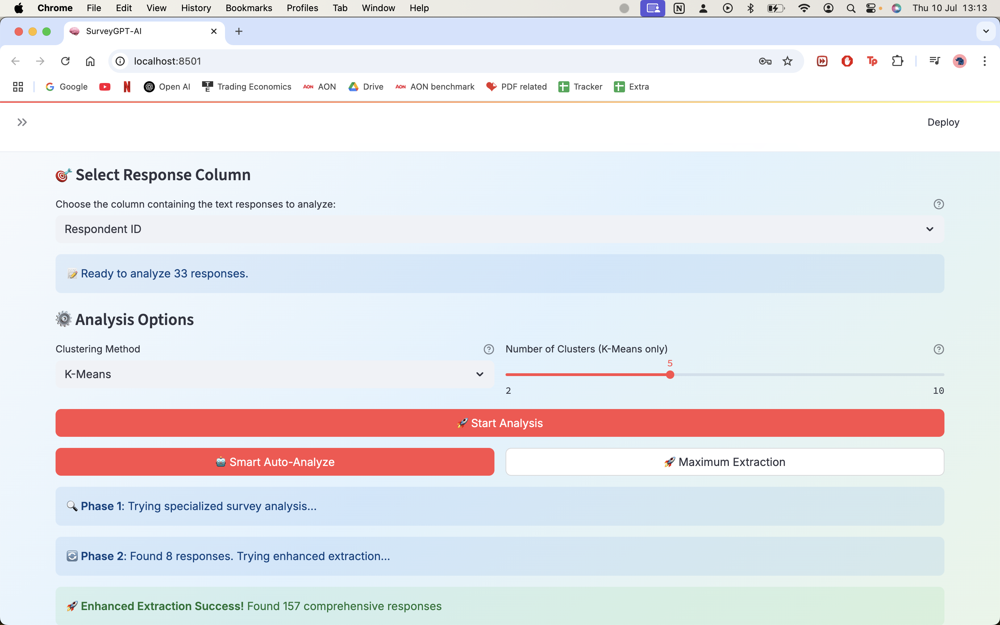

Summarize 800NPS in <5 mins!

# SurveyGPT-AI: Intelligent Survey Analysis Platform

## 🎯 Product Overview

**SurveyGPT-AI** is an enterprise-grade survey analysis platform that transforms raw survey data into actionable business insights using advanced AI and machine learning. The platform automatically processes multiple file formats, performs intelligent clustering, and generates comprehensive reports with sentiment analysis and business recommendations.

### 🚀 Key Value Propositions

- **Universal File Support**: Process CSV, Excel, PDF, Word, and text files from any survey platform  
- **AI-Powered Analysis**: Leverage GPT-4 for intelligent clustering and sentiment analysis  
- **Automated Insights**: Generate business recommendations with minimal manual intervention  
- **Enterprise Security**: Full authentication, user isolation, and secure data processing  
- **Professional Reporting**: Export-ready PDF reports with visualizations and executive summaries  

---

## 🏗️ Architecture Overview

### Technology Stack

**Frontend**  
- Streamlit (Python web framework)  
- React-inspired UI components  
- Interactive visualizations and dashboards  

**Backend**  
- FastAPI (RESTful API services)  
- Microservices architecture  
- CORS-enabled for cross-origin requests  

**AI/ML Stack**  
- OpenAI GPT-4 & GPT-3.5-turbo  
- Sentence Transformers for embeddings  
- scikit-learn for clustering  
- UMAP for dimensionality reduction  
- HDBSCAN for density-based clustering  

**Data Processing**  
- `pandas`, `pdfplumber`, `PyPDF2`, `openpyxl`, `python-docx`  

**Infrastructure**  
- Supabase for auth & data persistence  
- ReportLab for PDF generation  
- Streamlit Cloud deployment ready  

---

## 📋 Core Features

### 1. Multi-Format File Processing

- **CSV**: Google Forms, Typeform, SurveyMonkey, Qualtrics exports  
- **Excel**: `.xlsx/.xls` with multi-sheet detection  
- **PDF**: Table and text extraction with fallbacks  
- **Word**: `.docx` with paragraph and table support  
- **Text**: Plain text with encoding detection  

#### Smart Data Detection  
- Survey platform recognition  
- Column intelligence  
- Response extraction logic  
- "Other (please specify)" handling  

### 2. Advanced AI Analytics

#### Intelligent Clustering  
- K-Means with silhouette scoring  
- UMAP + HDBSCAN  
- Manual/automatic cluster tuning  

#### GPT-4 Insights  
- Summary generation with GPT-4  
- Sentiment detection with confidence scores  
- Multi-model fallback (GPT-3.5-turbo)  
- Thematic trend detection  

### 3. Professional User Interface

- React-like UI with Inter font  
- Drag-and-drop upload  
- Analysis progress tracking  
- Cluster & sentiment visualizations  
- Hero landing with CTA, feature showcase  

### 4. Authentication & Data Management

- Supabase login/signup  
- Session persistence  
- Secure multi-user environment  
- Audit trail and history  

### 5. PDF Report Generation

- Executive summary  
- Cluster details  
- Sentiment insights  
- Sample responses  
- Charts and data visualizations  
- One-click download with branding  

---

## 🔧 Technical Implementation

### Data Processing Pipeline

**Three Phases**
1. Specialized survey structure extraction  
2. Enhanced multi-column logic  
3. General fallback pipeline  

**Text Pipeline**
- Encoding detection  
- Table parsing  
- Text→DataFrame  
- Filtering irrelevant answers  

### API Architecture

- `/analyze`: Full clustering/summarization  
- `/embed`: Embeddings for semantic clustering  
- `/summarize`: Standalone GPT summaries  
- `/file`: File ingestion endpoint  

**Performance Features**
- Streaming progress  
- Efficient memory usage  
- Caching  
- Graceful degradation fallback  

---

## 🎯 Target Users & Use Cases

**Primary Users**
- Market Researchers  
- Product Managers  
- CX/CS Teams  
- Business Analysts  
- Academic Researchers  

**Use Cases**
- NPS + CSAT Feedback  
- Employee Pulse Surveys  
- Market/UX Research  
- Product Feedback  
- Thesis/Research Data  

---

## 📊 Performance Metrics & KPIs

**Technical**
- Processing speed  
- Clustering precision  
- Uptime  
- Error rate  

**Business**
- Monthly active users  
- Surveys processed/month  
- NPS / feedback  
- Feature usage analytics  

---

## 🚀 Deployment & Scaling

**Deployment**
- Streamlit Cloud (default)  
- Docker container support  
- CI/CD pipelines for staging/production  

**Scaling**
- Horizontal scaling (microservices)  
- API rate limiting  
- Caching  
- DB indexing  

---

## 🔒 Security & Compliance

**Data Security**
- End-to-end encryption  
- Role-based permissions  
- Audit logs  
- Configurable retention  

**Compliance**
- GDPR support  
- SOC 2 readiness  
- PII anonymization  
- Secure temp file handling  

---

## 🛠️ Development Roadmap

**Phase 1: Core Platform**
- ✅ File ingestion, clustering, PDF output, auth

**Phase 2: Enhanced Analytics**
- 🔄 Advanced visuals, API integrations, templates

**Phase 3: Enterprise Tools**
- 📋 SSO, white-labelling, user roles

**Phase 4: AI Expansion**
- 📋 Multi-language, predictive insights, training  

---

## 📝 Getting Started

### Prerequisites

- Python 3.8+  
- OpenAI API key  
- Supabase project  
- Install dependencies:

```bash
pip install -r requirements.txt

git clone https://github.com/your-username/surveygpt-ai.git
cd surveygpt-ai
cp .env.example .env  # Fill in your environment variables
streamlit run app.py



